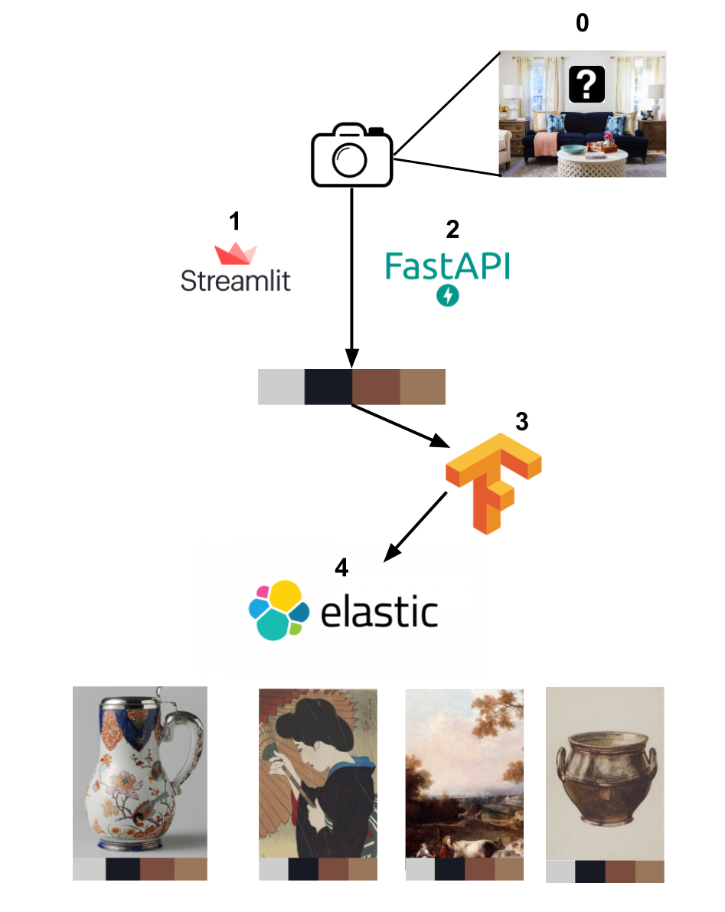

# ART SUGGESTOR BASED ON COLOR PALETTE

This app allows you to upload a picture of your room, and based on the dominant colors palette, suggests you beaufiful matching paintings.

## Project description

Takes a picture as input, finds the dominant colors palette and calculates a word embedding of it using a [pre-trained Google's model](https://github.com/googleartsculture/art-palette). Based on previously indexed images finds the most similar ones.

## Architecture of the APP

## Steps to install

1. Install [Elasticsearch](https://www.elastic.co/)
2. Run the Elasticsearch server
3. Create the index running the script `python scripts/create_index.py`
4. Generate `paintings.csv` file using your prefered scraper or use our already scraped site.
5. Generate the palette for each image running `python scripts/palettes_generator.py`
6. Generate the palettes embeddings by running `python scripts/embeddings_generator.py`
7. Index all the images using the script `python scripts/indexer.py`

